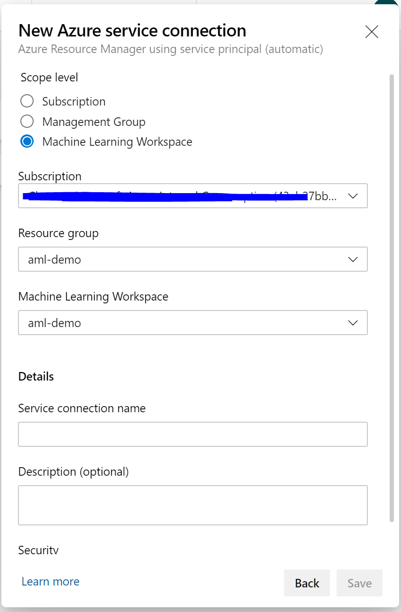

# Introduction 

This repo shows an E2E training and deployment pipeline with Azure Machine Learning's CLI for implementing MLOps. For more info, please visit [https://docs.microsoft.com/azure/machine-learning/service/reference-azure-machine-learning-cli](Azure Machine Learning CLI documentation).

Install the Machine Learning DevOps extension in your project [from here](https://marketplace.visualstudio.com/items?itemName=ms-air-aiagility.vss-services-azureml) to scope your project to your Azure Machine Learning service workspace. 

# How to use

This example requires familiarity with Azure Pipelines or GitHub Actions. For more information, see [this link](https://docs.microsoft.com/azure/devops/pipelines/create-first-pipeline?view=azure-devops&tabs=tfs-2018-2).

This example also requires an Azure Machine Learning service workspace. For more information, see [this introduction](https://docs.microsoft.com/azure/machine-learning/service/setup-create-workspace).

You can clone/fork this repo and use it with Azure Pipelines. Before creating the pipeline you must do the following:

1. Create a new project in Azure DevOps/Pipelines
1. Goto `Project settings`, select `Service connections`, create a new connection of type `Azure Resource Manager`, select `Service principal (automatic)` and configure it to the `Machine Learning Workspace`. Name it `azmldemows` and point it to your Azure Machine Learning workspace (see [here](https://docs.microsoft.com/en-us/azure/devops/pipelines/library/service-endpoints?view=azure-devops) for more details)
1. Modify the `pipelines/diabetes-train-and-deploy.yml` and change the `ml-rg` variable to the Azure resource group that contains your workspace. You must also change the `ml-ws` variable to the name of your Azure Machine Learning service workspace.

1. When creating the pipeline for the project, you can point it to the `pipelines/diabetes-train-and-deploy.yml` file. This defines an example pipeline.

