# Intial setup for Azure DevOps

This tutorial covers:

* Creating an Azure Machine Learning workspace in Azure
* Setup on an end-to-end demo pipeline in Azure DevOps

## Create an Azure Machine Learning workspace

Create a new Machine Learning Workspace by clicking [here](https://ms.portal.azure.com/#create/Microsoft.MachineLearningServices). This link brings you directly to the creation page in the Azure Portal:

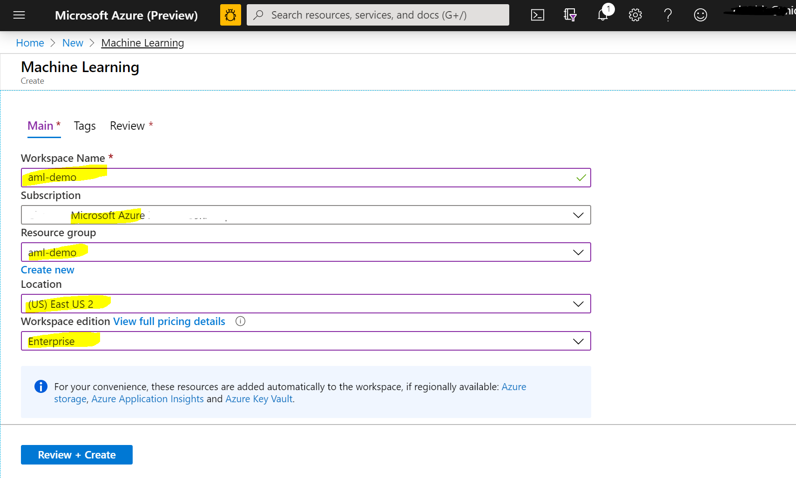

This repo uses `aml-demo` as the workspace and reosurce group name. Feel free to pick a region of your choice and select `Enterprise Edition` (`Basic` should work too, but has not been tested). CLick `Review + Create` and finally `Create`.

## Create and setup a new project in Azure DevOps

Navigate to [Azure DevOps](https://dev.azure.com/) and sign-in. From there create a new project and give it a name: 

Next, you need to connect Azure DevOps to your Azure Subscription, to be more precise, to your Machine Learning workspace's resource group. For this, go to the `Project Settings` and select `Service Connections`:

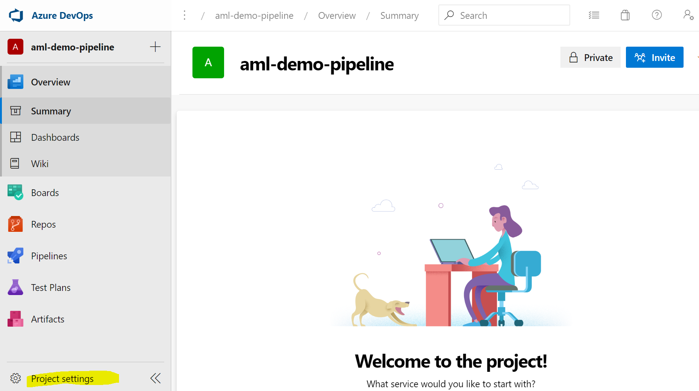

From there, create a new Service Connection of type `Azure Resource Manager`:

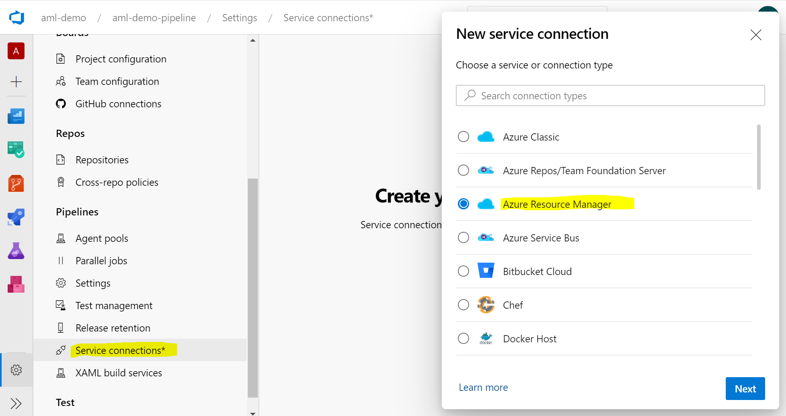

Lastly, give it a name (this repo uses `azmldemows` as default), and enter the details of your Resource

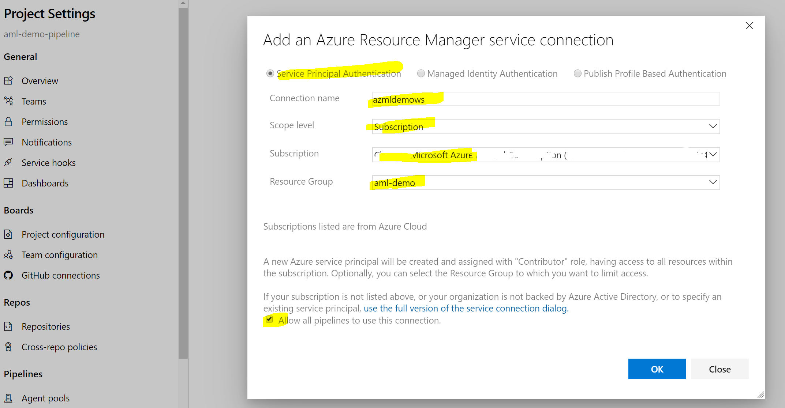

**Note:** If you want to limit Azure DevOps's access to only the Machine Learning workspace, you can install the [Azure DevOps Machine Learning Extension](https://marketplace.visualstudio.com/items?itemName=ms-air-aiagility.vss-services-azureml) to your project. In this case, you'll be able to select the Machine Learning workspace.

## Import existing YAML pipeline to Azure DevOps

Next, select `Pipelines` and create a new pipeline. Select that you want to access code from GitHub:

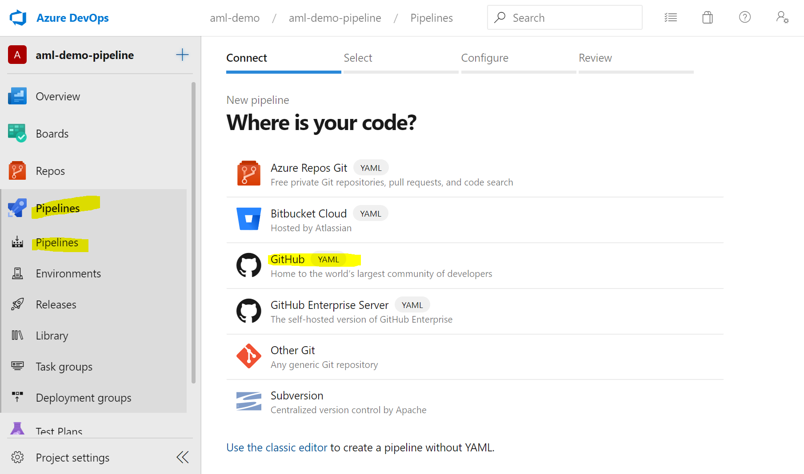

**Note:** At this point, you might need to link your GitHub account to Azure DevOps (not shown here).

Select the repository fork you've selected earlier:

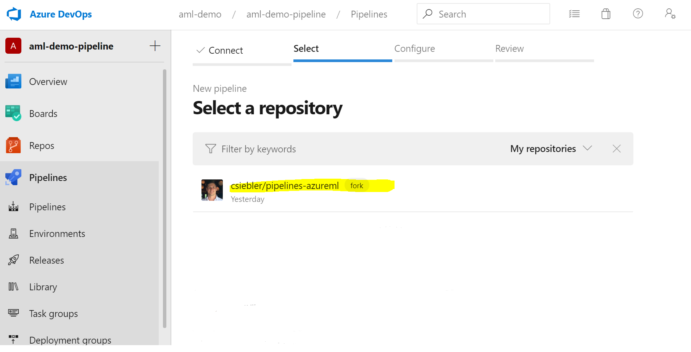

Next, let's point the new pipeline to an existing pipeline YAML in your GitHub repo:

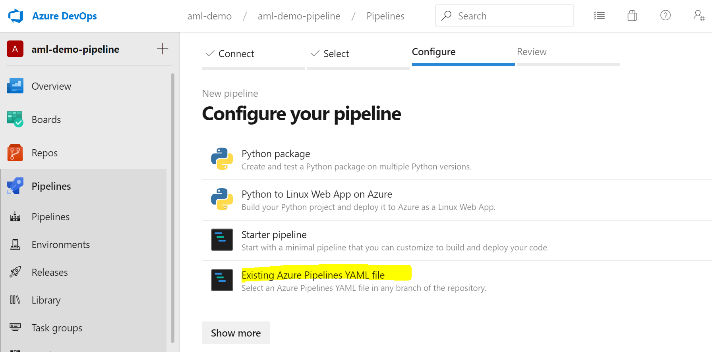

Lastly, we need to select from where the pipeline definition should come from. In this case, point it to `pipelines/diabetes-train-and-deploy.yml`:

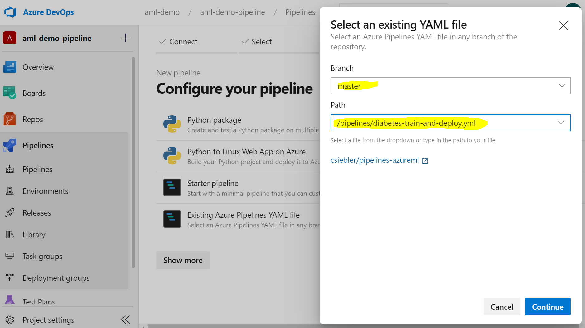

In the next step, you can review the pipeline. In case your `Service connection` or `Machine Learning workspace`, etc. are named differently, you can update the variables here:

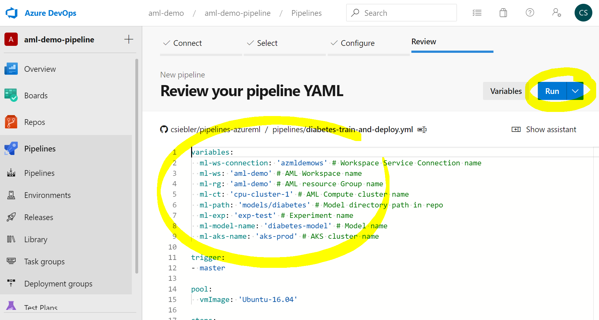

Once the configuration looks right, give it a test run:

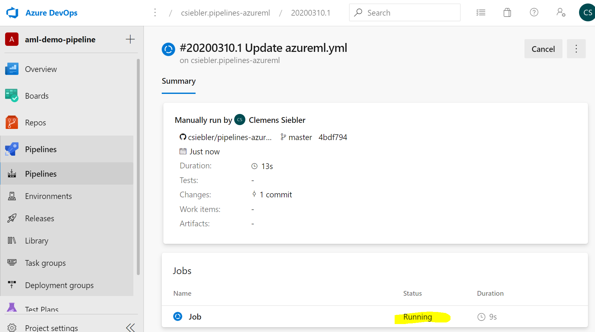

By clicking on the pipline job, you can retrieve more details:

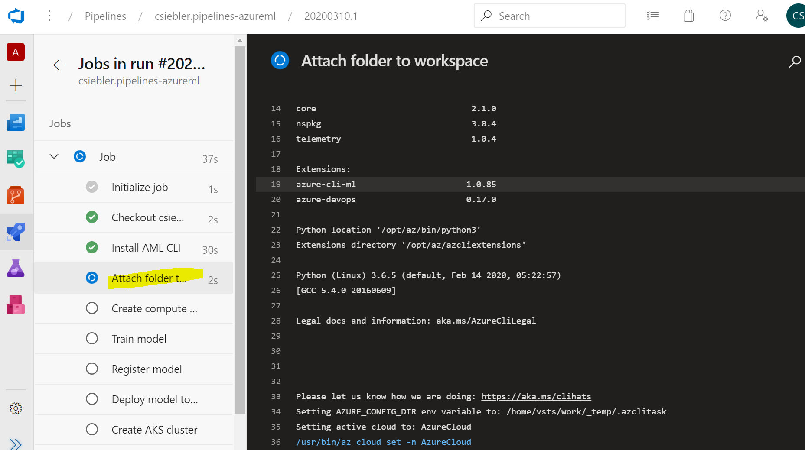

That's it! Your first model should be training by now! :thumbsup: